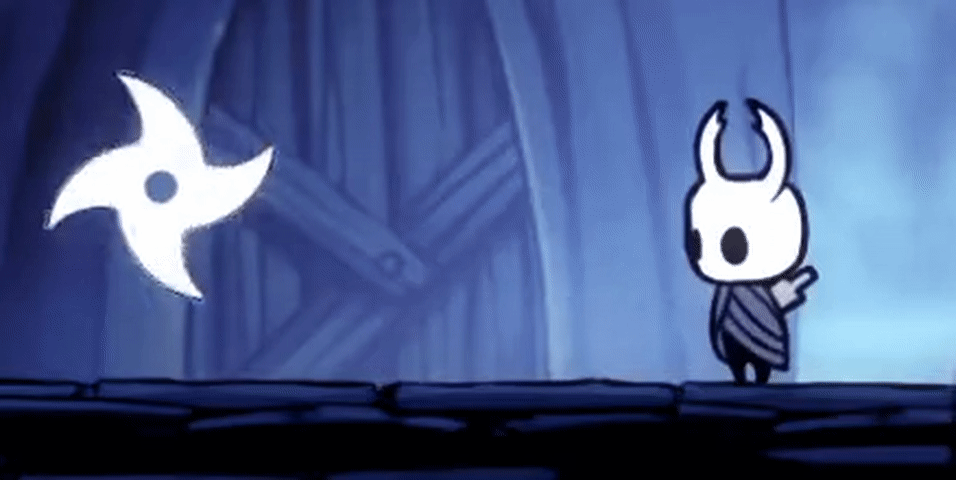

# Shuriken

A tiny rando extension a new skill to the game: a shuriken that you can teleport to!

## Features

* Adds a customizable key to spawn.
* Press the key to spawn, press again to hover. On hover:
  * Key + Up to teleport to it
  * Key + Down to destroy it
  * Key again to call it back
* Contact damage scales with shaman, hover damage scales with nail upgrades and both scale with the amount of shuriken aquired
* Randomize the ability to teleport
* Scale infinetly by randomizing as many shurikens as you want

## Customization

The sprites are loaded on initialize and can be customized. Create your own 512x512 image and replace the "sprite.png" file on the mod static folder. To replace the pick up icon replace the "rando.png" file in the static folder with your 100x100 image. 

## Credits

This mod used code or consulted the following:
* [SmollKnight](https://github.com/PrashantMohta/Smolknight) by Dandy & Mulhima
* [RandoPlus](https://github.com/flibber-hk/HollowKnight.RandoPlus) by Flib
* Randomizer, Randomizercore, Itemchanger and MenuChanger by Homothethy and Flibber
* [Satchel](https://github.com/PrashantMohta/Satchel) by Dandy
* [RainbowEggs](https://github.com/dpinela/RainbowEggs) by Pimpas
* [Modding Docs](https://prashantmohta.github.io/ModdingDocs/)

If you recognized something that wasn't credited here, please feel free to contact me.
Special thanks to Mulhima for the help with the menus and Dwarf for playtesting.
